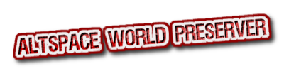

  
A tool to help altspacer preserve worlds before Altspace shuts down.  
# Prerequisites
### **You must have the 2020.3.9f1 or 2020.3.18f1 Unity Editor installed (versions that's compatible with Altspace)**
# Download
- Go to the [release page](https://github.com/The-Free-MRE-Foundation/awp/releases), and download the tgz file.
# Installation
- Open Unity Hub and create a new Unity **2020.3.9f1** or **2020.3.18f1** project. For your template, select **3D core**.
- In Unity on the menu bar, select Window > Package Manager.
- In the Package Manager menu bar, select the plus sign drop down ("+"), and then select Add package from tarball.
- Navigate to the folder that contains the Altspace World Preverse .tgz file, then select it, and then click Open.
- After the package loads, you should see it in the Package Manager, you will also see a new Altspace World Perserver menu on the menu bar
# Update to a Newer Version
- You can remove the package then reinstall  
or you can simply overwrite the older tgz with the new one it will automatically reload
# Usage
- Click the AWP menu item, Login
- On first login, the plugin will download necessary dependencies please for it to finish
- Type in your credentials and click login
- Click select a world
- Click load to load a list of your worlds
- Click the corresponding select button to confirm world selection
- Click preserve to start preserving that world
# Join Us
### vrsocial.org  

### freemre.com

---
> **Note**  
> By downloading you agree to not use this tool for any malicious intentions,or in any illegal form, abide by International Copyright laws, not to resell this tool, and not in any form profit from any method using this tool.  
By agreeing, you agree that you will only use the tool for "lawful use" and not use in any account you do not own.  
Anyone caught doing so will be banned permanently from all future projects including updates on this one.  
The creators of Altspace World Preserver will NOT be responsible for any action performed by any user using this tool.  
By using this tool you agree to use it lawfully and use it accordingly and responsibly for your own worlds.  
If you planned to use the content for illegal purpose, you shall be liable for any damages not the creators, this is merely a tool for preserving your OWN worlds that you have permission over, for anything that you DO NOT own please contact the creator for permission shall you use it to upload on anyother platforms, if you do not agree with this please do not use this tool.  
It's not mandatory to credit the authors, but doing so incentivizes us to make more free tools like this.  If you think this tool saves you some time, please consider supporting us by joining our discord server.
